## Android Clean Architecture MVVM

Android uygulama geliştirmede modern mimarilerden biri olan Clean Architecture ve MVVM (Model-View-ViewModel) desenininden bahsedeceğim. Clean Architecture, uygulamanın farklı bileşenlerini bağımsız hale getiren, sürdürülebilir ve test edilebilir bir yapıyı benimseyerek, kodun daha yönetilebilir olmasını sağlar. MVVM ise, kullanıcı arayüzü (UI) ile iş mantığını birbirinden ayıran bir desen olup, UI'nin iş mantığından bağımsız olarak çalışmasını sağlar. Android'deki Clean Architecture yapısı genellikle dört ana katmandan oluşur: Presentation, Domain, Data, ve Util. MVVM mimarisi ise özellikle Presentation katmanında kullanılır. Bu yapılar birlikte, uygulamanın ölçeklenebilirliğini artırır, test edilebilirliğini sağlar ve bakımını kolaylaştırır.

## Basit Bir Clean Architecture Akış Diyagramı

```mermaid
flowchart TD

    %% Presentation Layer
    subgraph Presentation_Layer
        PA[UI Components]
        PB[ViewModel]
        PC[Navigation]
    end

    %% Domain Layer
    subgraph Domain_Layer
        DA[Repository Interfaces]
        DB[UseCases]
        DC[Domain Models]
    end

    %% Data Layer
    subgraph Data_Layer
        DLA[Local Data Source]
        DLR[Remote Data Source]
        DLM[Data Mappers]
        DLD[Data Models]
        DLRP[Repository Implementations]
    end

    %% Util Layer
    subgraph Util
        UA[Utility Classes]
        UB[Helpers]
        UC[Extensions]
    end

    %% Bağlantılar
    PA --> PB
    PB --> DB
    DB --> DA
    DA --> DLRP
    DLRP --> DLA
    DLRP --> DLR
    DLR --> DLD
    DLA --> DLD
    DLD --> DLM
    DLM --> DC
    DLM --> UA
    DLD --> DC
    DC --> DB
```

# Android için Clean Architecture paket yapısı
- data
    - local
    - remote
    - mapper
    - repository
- di
- domain
    - repository
    - model
    - usecase
- presentation
    - common
      - navigation
      - components
    - viewmodel
    - screens
      - home
- util

# Data
Data paketi, uygulamanın veri yönetimi ve veri kaynaklarıyla doğrudan etkileşim kurduğu katmandır. Bu katmanda, veri modelleri, veri kaynaklarına erişim sağlayan sınıflar ve veriyi dönüştüren (mapper) sınıflar bulunur.
- Local
    - Local paketinin içerisinde yerel veri kaynaklarına erişim sağlanır. Bunlar kotlin için örneğin room kütüphanesinin databaseleridir.
- Remote
    - Remote paketinin içerisinde uzak veri uzak veri kaynaklarına erişim sağlanır. API'den veri çekme DTO(Data Transfering Object) benzeri şeyler bu katmanda yer alır.
- Mapper
    - Mapper kaynağı Data paketeinin içinde veya bunlardan bağımsız başka bir katman olarak tanımlanabilir. Mapper katmanı veriyi başka bir katmana dönüştürür. Örneğin Remote paketinin içinde bulunan bir API'yi çektik fakat uygulamada kullandığımız ve kullanmadığımız verileride getirdi bu durumda gelen verileri mapleyip, Domain Paketinin içindeki Modelimize dönüştürürüz.

# DI(Dependency Injection)

DI (Dependency Injection) paketi, Dependency Injection (Bağımlılık Enjeksiyonu) yapılandırmalarını içerir. Repository, Use Case, Remote ve Local veri kaynakları gibi bağımlılıkları sağlayan Hilt/Dagger modülleri burada yer alır. Bu modüller, ilgili bağımlılıkları sağlayarak uygulamanın diğer bölümlerinde ihtiyaç duyulan sınıfların otomatik olarak enjekte edilmesine olanak tanır.

# Domain 

Domain paketi uygulamanın iş mantığı ve temel modellerini içerir kısaca iş mantığı kısmı diyebiliriz. Domain paketinde hiçbir zaman Data ve Presentation kısımlarına bağımlılık olmaz.
- Repository
  - Domain paketi içerisinde bulunan repository kısmı Data paketindeki repositoriden farklıdır. Bu paketteki Repositoryler Interfacedir ve Data katmanında bulunan Repositoryler tarafından Implement edilir. Isimlendirmeler Domain paketi için Repository, Data paketi için RepositoryImpl olarak yapılır.
- Model
  - Domain paketinde kullanılan veri modellerini içerir. Data/Remote aracılığıyla gelen veriler Data/Mapper altında dönüştürülerek bu katmandaki Modele aktarılır.
- Usecase
  - Uygulamanın belli bir işlevselliğini getiren iş mantıklarını içeren pakettir. Örneğin Data/Remote içerisinden verileri getirir.

# Util

Util paketi, uygulamanın her katmanında kullanılabilecek yardımcı sınıfları ve fonksiyonları içerir. Tekrar eden kodların bu pakette toplanması uygulamayı daha modüler ve düzenli hale getirir. 
Örneğin 
  - Constants: Uygulama genelinde kullanılacak sabitler tanımlanır.

# Presentation

Presentation paketi, uygulamanın kullanıcı arayüzüyle etkileşimde olduğu katmandır. MVVM (Model-View-ViewModel) yapısını kullanarak ViewModel’leri ve UI bileşenlerini içerir.
- Viewmodel
  - Her bir ekran için bir ViewModel sınıfı tanımlanır. ViewModel sınıfları, UseCase sınıflarını çağırarak veriyi elde eder ve UI’a uygun hale getirir. Bu ViewModel’ler, Dependency Injection ile ilgili UseCase’leri alır ve gerekli işlemleri yönetir.
- Common
  - Bu kısımda Navigation ve Component gibi çoğu ekran tarafından kullanılan fonksiyonları ve dosyaları barındırır.
- Screens
  -  Bu pakette kullanıcya sunulan UI sayfaları yer alır. Örneğin Home sayfası için bir paket açılır, sadece home paketinde kullanılan Componentler ve sayfa burada yer alır.
  -  
# MVVM(Model-View-ViewModel)

ViewModel, MVVM (Model-View-ViewModel) mimarisinde UI (kullanıcı arayüzü) ile iş mantığı arasındaki bağlantıyı sağlayan bileşendir. Özellikle Android uygulamalarında kullanıcının uygulama ile etkileşime geçtiği süreçleri daha yönetilebilir hale getirmek için kullanılır.

- Veriyi Yönetme ve Sağlama:
  
  - ViewModel, UI’nın ihtiyaç duyduğu veriyi LiveData, StateFlow, MutableState gibi gözlemlenebilir (observable) veri türleri kullanarak sağlar.
  - Örneğin, bir kullanıcı arayüzünde bir listede gösterilecek veriyi ViewModel alır ve ViewModel, UI’ya bu veriyi sağlamaktan sorumludur. Böylece, verinin alınması veya güncellenmesi gerektiğinde yalnızca ViewModel güncellenir ve UI da bu değişiklikleri gözlemleyerek kendini günceller.

- UI Durumunu Koruma:

  - Android’in yaşam döngüsüne duyarlı olarak, ViewModel ekran döndürüldüğünde veya uygulama arka plana alınıp yeniden açıldığında veri kaybını önler.
  - ViewModel, aktivite veya fragment yeniden oluşturulsa bile yaşam döngüsünden bağımsız olarak varlığını koruduğu için UI durumu kalıcı olur.

- Veri İşlemlerini ve İş Mantığını Yönetme:

  - İş mantığına göre Repository ya da UseCase sınıflarını çağırarak veri işlemlerini yönetir.
  - Örneğin, bir ürün listesi gösteriliyorsa ViewModel ilgili UseCase veya Repository sınıfını çağırarak ürünleri getirir. Bu veri işlemlerini UI katmanında yapmak yerine ViewModel üzerinden yönetmek, kodun okunabilirliğini artırır ve test edilebilirliğini kolaylaştırır.

- UI’ı Güncel Tutma:

  - ViewModel, iş mantığında veya veri akışında değişiklik olduğunda UI’yı günceller.
  - Örneğin, bir API çağrısı yapıldığında veya yerel veritabanında bir güncelleme gerçekleştiğinde bu değişikliği UI’ya bildirir. UI katmanı sadece ViewModel’den gelen değişikliklere göre güncellenir ve veri akışını doğrudan kontrol etmez.

- Uygulamanın UI Katmanını Temiz Tutma:

  - ViewModel, iş mantığını ve veri yönetimini üstlenerek UI katmanında bu işlemlerin yapılmasını önler. Bu sayede UI sınıfları (örneğin Activity veya Fragment) yalnızca kullanıcı etkileşimlerini yakalar ve bu etkileşimleri ViewModel’e iletir.
  - UI katmanını yalnızca görselleştirmeye odaklayarak daha modüler ve sorumlulukları belirli bir yapı sağlar.

## ViewModel'in Avantajları
 - Veri Korunur: ViewModel, yaşam döngüsüne duyarlı olduğu için uygulamanın UI durumu ekran döndürülse bile korunur.
 - Sorumluluk Ayrımı: Veri işlemleri ve UI yönetimi birbirinden ayrılır, bu da daha temiz bir yapı sağlar.
 - Test Edilebilirlik: ViewModel, UI’dan bağımsız olduğu için iş mantığı testleri kolaylıkla yapılabilir.
 - Modülerlik: İş mantığının ayrı bir bileşende olması, kodun yeniden kullanılabilirliğini ve genişletilebilirliğini artırır.

Kısacası ViewModel, veriyi yönetme, UI güncelleme ve iş mantığını yönetme gibi görevleriyle uygulamanın yapı taşlarından biridir.

## Veri Akış Diyagramı 

## Hata Yönetimi Akış Diyagramı

- [Android Developer Documentation](https://developer.android.com) Android uygulama geliştirme konusunda resmi kaynaklardan biri, Android için gerekli tüm temel belgeleri, örnekleri ve rehberleri sunar.

- [Jetpack Compose Documentation](https://developer.android.com/jetpack/compose), Android için modern UI araçları sunar. Bu kaynak, kullanıcı arayüzü geliştirmek için gerekli bileşenleri ve araçları sunarak Compose hakkında detaylı bilgiler sağlar.

- [Android Architecture](https://developer.android.com/topic/architecture), Android uygulama geliştirme için doğru mimari desenleri ve uygulama yapılarını benimsemek isteyen geliştiriciler için rehberlik eder. Clean Architecture, MVVM ve diğer modern Android mimarisi yaklaşımlarını anlatan bu sayfa, uygulama yapılandırmalarını, bileşenlerini ve veri yönetimini nasıl organize edeceğiniz konusunda ayrıntılı bilgiler sunar.

# Android Clean Architecture and MVVM

In this document, we’ll explore Clean Architecture and MVVM (Model-View-ViewModel) – two of the most popular modern architectures in Android development. Clean Architecture promotes a sustainable, testable, and modular structure by making application components independent of each other. MVVM separates UI (user interface) from business logic, allowing the UI to function independently of business logic. Typically, Android's Clean Architecture structure consists of four primary layers: Presentation, Domain, Data, and Util, with MVVM specifically utilized in the Presentation layer. Together, these structures improve app scalability, testability, and maintainability.

## A Simple Clean Architecture Flow Diagram

## Clean Architecture Package Structure for Android

- **data**
    - local
    - remote
    - mapper
    - repository
- **di**
- **domain**
    - repository
    - model
    - usecase
- **presentation**
    - common
      - navigation
      - components
    - viewmodel
    - screens
      - home
- **util**

### Data

The Data package directly interacts with data sources and handles data management for the application. This layer includes data models, classes that access data sources, and mappers for transforming data.

- **Local**
    - This package accesses local data sources, such as Room databases for Kotlin.
- **Remote**
    - This package accesses remote data sources, such as APIs. Data Transfer Objects (DTOs) are often used here.
- **Mapper**
    - The Mapper can be defined within the Data package or as an independent layer. It transforms data for other layers. For example, data from the Remote package can be mapped and converted to the model in the Domain package.

### DI (Dependency Injection)

The DI (Dependency Injection) package contains the configurations for Dependency Injection. Modules for Hilt/Dagger provide dependencies for repositories, use cases, and data sources, allowing these classes to be injected automatically where needed in the application.

### Domain

The Domain package encapsulates the application's business logic and core models. It does not depend on the Data or Presentation layers.

- **Repository**
  - The Domain package includes repository interfaces, which are implemented by repositories in the Data package. Domain repositories are named as `Repository`, while Data repositories use the suffix `RepositoryImpl`.
- **Model**
  - Contains the data models used within the Domain package. Data retrieved from Data/Remote is transformed to the model in this package.
- **Usecase**
  - Includes business logic or functionalities of the app. For example, Usecases retrieve data from the Data/Remote layer.

### Util

The Util package includes helper classes and functions usable across the app layers, making the application more modular and organized.

### Presentation

The Presentation package interacts with the user interface. It uses the MVVM (Model-View-ViewModel) pattern to separate ViewModels and UI components.

- **Viewmodel**
  - Defines a ViewModel class for each screen. ViewModels retrieve data from Usecases and format it for the UI. Dependency Injection is used to inject Usecases into ViewModels.
- **Common**
  - Contains shared functions and files like Navigation and Components.
- **Screens**
  - Contains the UI screens of the application. For example, there may be a package for the home screen, where UI components specific to that screen are organized.

## MVVM (Model-View-ViewModel)

The ViewModel in MVVM serves as the intermediary between the UI and the business logic, making user interactions more manageable and modular, particularly in Android applications.

- **Managing and Providing Data**
  - ViewModel provides data to the UI using observable data types such as LiveData, StateFlow, and MutableState.
- **Maintaining UI State**
  - ViewModel helps preserve data across screen rotations or background processes by persisting independently of the activity or fragment lifecycle.
- **Managing Business Logic and Data Operations**
  - ViewModel calls Usecases or Repositories to retrieve and process data.
- **Updating the UI**
  - ViewModel notifies the UI of data or flow changes, allowing the UI to update accordingly.
- **Keeping the UI Layer Clean**
  - ViewModel handles data and business logic, leaving the UI layer to focus solely on rendering the interface.

### Advantages of ViewModel
- **Data Preservation**: ViewModel preserves the UI state across configuration changes.
- **Separation of Concerns**: ViewModel separates data and UI management.
- **Testability**: ViewModel logic can be tested independently of the UI.
- **Modularity**: ViewModel promotes reusability and extendability.

## Data Flow Diagram

## Error Handling Flow Diagram

## Resources

- [Android Developer Documentation](https://developer.android.com) provides all essential documents, examples, and guides for Android app development.
- [Jetpack Compose Documentation](https://developer.android.com/jetpack/compose) details the modern UI tools for Android, with components and tools necessary for creating UIs.
- [Android Architecture](https://developer.android.com/topic/architecture) is a guide for selecting architectural patterns, covering Clean Architecture, MVVM, and other approaches to organizing data and business logic in Android.
